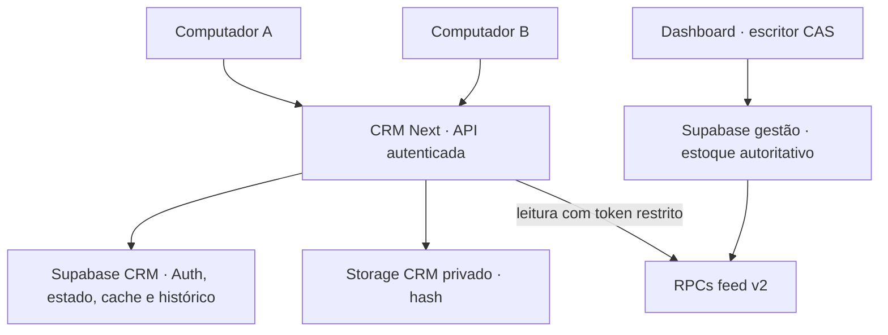

# CHECKPOINT — implementação estrutural DAF Dashboard ↔ CRM

**8 de outubro de 2026 · continuidade para homologação com Sol**

A fundação independente foi implementada, enviada ao repositório de fonte e testada nos ambientes disponíveis. **Não houve implantação operacional, merge, migration de produção, uso de credencial real da integração, alteração de registro real, pareamento, envio/recepção WhatsApp ou ZIP final.** Este checkpoint não declara interoperabilidade real homologada.

Orientação preservada: `CHECKPOINT-ARQUITETURA-DAF-DASHBOARD-CRM-2026-10-08.md`, checkpoints de 7/10 e relatórios de validação de 8/10, lidos antes das alterações. Não foi refeita a auditoria geral nem incorporada a branch `fabio`.

## 1. Estado atual dos dois códigos e commits

| Fonte | Referência comprovada |
| --- | --- |
| Dashboard main, início e última conferência | `0ffcfd65edf9141f44c0fd31c1370b226438bf9c` — **zero commits novos** desde o checkpoint |
| PR #17 inicial | `316a707bad1f9cec90dc3b657c25403b05b8f217` |
| PR #17, branch oficial | `crm/read-only-feed-20261006`, baseada na main indicada, aberta, não mesclada; na conferência draft=false |
| Novo commit dashboard D1/D2 | `6bacfd888173fa8c3b170f4d16c862f9e93c3fd8` — feed condicional, CAS, identidades e rollout |
| Novo commit dashboard escritor CAS | `6e0931579645472815868855991b7cc131c25263` — persistência, preservação de rascunho e testes |
| HEAD final da PR | Commit de documentação que contém este checkpoint, posterior aos dois commits acima; SHA exato na entrega final/metadados da PR. Nenhuma alteração de código adicional nesse commit |
| CRM fonte consolidada inicial | `b4e87af5b90f2b1b9336c119f8edb4cd6251517f` |
| CRM fonte final enviada e conferida pelo helper | **`08d564bc145c8d2a2354280020a2f28375c54fe6`**, árvore limpa após envio |
| Projeto Sites | `appgprj_6ac4587d2d588191b13f376ec8c444db` — DAF CRM — Piloto dos sócios |
| Localização do independente no commit CRM | `independent/`, autocontido, 85 arquivos alterados/adicionados no commit incluindo exclusão do diretório no tsconfig do app legado |
| Versão Sites listada ao final | **4**, fonte inicial `b4e87af…`; nenhuma nova versão salva/deployada foi confirmada |
| GitHub/Vercel próprios do independente | **Ainda não criados**. A fonte independente está versionada no repositório privado da fonte Sites; não afirmar que já está em um GitHub próprio |

**Incidente de encerramento:** o salvamento de versão sem deploy ficou sem resposta; o ambiente local desconectou (`environment_offline`) depois dos gates e do commit enviado. A operação de espera foi encerrada e a listagem subsequente ainda retornou somente versões 1–4. Não repetir a tentativa sem conferir se ela terminou depois. O commit acima já foi enviado/conferido e é a referência segura para retomar. O checkpoint foi persistido diretamente na PR pelo conector GitHub, sem depender do ambiente desconectado.

O Sites existente foi observado com audiência `public`; esta execução **não mudou audiência nem publicou uma nova base**. A alegação antiga de “preview privado confirmado” não deve ser repetida. A próxima execução deve revisar essa configuração antes de usar dados pessoais em qualquer preview.

## 2. Funcionalidades realmente portadas para Next.js/Vercel

Next.js **16.3.4**, React **19.2.6**, Node **24.19.0** usado na validação, SSR com Supabase Auth, `output: standalone`, backend Node em rotas autenticadas. Build otimizado aprovado. Não há Worker/D1/ChatGPT Auth como dependência do runtime independente.

| Módulo preservado | Implementação independente |
| --- | --- |
| Agenda/calendário | Horários Brasília, revisão/aprovação, simulação, fila, remarcação e execução protegida; relógio não foi provisionado |
| Clientes/ficha | XLSX nome/telefone/status Falta chamar, preferências, notas, interesses, histórico e vínculo automático com gestão |
| Pedidos | Rascunho/intenção, itens, Pix, frete/rastreio, preparação/envio/recebimento locais; sem baixa na gestão |
| Feedbacks | Registro, acompanhamento/status, classificação positiva/negativa, relação com contato; feedback do piloto separado |
| VIP/recompra/pós-venda | Critérios e resumos existentes com compras observadas; modelos de mensagens e tarefas |
| Copies | Biblioteca, mídia compartilhada, variáveis novas/legadas, revisão, exclusão/arquivamento seguro |
| Relatórios/Hoje/atendimento | Segmentos, métricas, filas, histórico e informações de relacionamento existentes |
| Histórico | Payloads de tentativas, simulações, saldo/revisão/destino/mídia efetivos preservados |
| Integrações/automações | Status sem segredo, sync automático, endpoints de executor/recepção preparados, tráfego desabilitado |

Os componentes existentes foram transportados, não substituídos por telas simuladas. `lib/integrations.ts` e SQL SQLite em `tests/fixtures/legacy-drizzle/` permanecem para regressão do adaptador legado; **não são o escritor usado pelas rotas Next**. O adaptador ativo está em `server/`. O aplicativo Sites da raiz continuou compilando/testando e não recebeu nova publicação.

## 3. PostgreSQL e migrations preparadas

Todas aplicadas **somente a bancos PGlite descartáveis com fixtures**; nenhuma conexão SQL de produção foi aberta. Build não executa SQL.

| Arquivo CRM | Responsabilidade |
| --- | --- |
| `20261008100000_crm_foundation.sql` | Workspaces/membros, estado/revisão/CAS, snapshots, cache/aliases, effects, aprovações, leases, outbox, inbound, simulações e feedback interno; funções privadas, RLS e grants explícitos |
| `20261008103000_crm_private_assets.sql` | Bucket privado crm-media e metadata por workspace/hash; 1 MB, tipos permitidos, nenhuma URL pública |
| `20261008104000_crm_operations.sql` | Simulação, revogação de aprovação, liberação de lease, payload imutável e confirmação de recebimento de venda observada |
| `20261008105000_crm_legacy_transport.sql` | Transporte para destino vazio/desligado, autores legados, manifesto/cache sem vínculo, histórico/IDs/recibos/outbox |

C1–C5 do desenho aprovado estão distribuídos nesses quatro arquivos; não confundir essa nomenclatura com quantidade de migrations. Revisões bigint trafegam como **strings**, inclusive valores acima de Number.MAX_SAFE_INTEGER. Documento editável limitado a 1,5 MB e snapshots anteriores com retenção de 10; cache da fonte separado.

RPCs de usuário: `crm_read_context`, `crm_save_state`, `crm_source_page`, `crm_remove_or_archive`. Operações de serviço de sync/aprovação/executor/outbox/inbound/importação têm grants exclusivos de backend. Usuário autenticado não recebe escrita direta nas tabelas nem RPC de serviço.

## 4. Integração automática implementada

Backend consulta `daf_crm_sync_feed` condicional. Fallback a `daf_crm_feed` só para função ausente `PGRST202`, nunca para falha de autorização/rede. Origem Supabase HTTPS fixa e projetos CRM/gestão separados, identidade esperada, contrato v2, revisão/hash e listas completos validados. Token só no backend.

Bootstrap/foco/online/poll de fonte a cada 30 s, backoff até 5 min; revisão de interface a cada 10 s quando visível. Lease de 20 s coalesce os dois dispositivos e impede aplicação atrasada. Cada snapshot tem cache_revision e watermarks de origem; sync sem mudança não incrementa revisão de relacionamento nem cria snapshot/tarefa. Erro registra diagnóstico **sem apagar cache válido**. Tombstones preservam clientes/vendas removidos da fonte.

Produtos/IDs/nome/marca/categoria/gênero/stock/APC/evidências, clientes/telefone/endereço/CEP, vendas/itens/ml/APC/pagamento/estados/cancelamentos/preparação/envio alimentam o CRM sem arquivo. Campos financeiros excluídos do contrato original continuam excluídos. Flags diferenciam recebíveis históricos e ausência de preparação observada.

Aliases e UUIDs persistidos evitam duplicação em novo sync e preservam identidade quando números são reutilizados. Telefone/nome ambíguos não unem pessoas automaticamente. Cliente marketplace sem vínculo não vira contato pessoal. Relação source_order evita dupla contagem de compra preparada no CRM e observada na gestão.

Primeiro sync é baseline silencioso. Eventos prospectivos por venda só quando UUIDs/writer CAS-only estiverem comprovados. Envio observado cria tarefa de confirmar recebimento, não mensagem automática. Confirmação recebido grava complemento/tarefa uma única vez no CRM, sem atualizar gestão. Cancelamento/desaparecimento invalida pendências, conserva histórico e **não recalcula estoque**.

JSON/TXT permanece recuperação/diagnóstico. Modo file/legacy não valida envio real. O cache não é um segundo estoque. Nome/telefone/endereço observados continuam atualizando mesmo quando o usuário salva uma nota; overlays de relacionamento ficam separados.

## 5. Sessões simultâneas, CAS e persistência

Supabase Auth próprio do CRM, mesma conta em dois computadores, associação ativa ao workspace, assinatura/usuário validados no backend e sessão `auth.sessions` ativa conferida no SQL. Cookies HttpOnly, SameSite=Lax, Secure em HTTPS, renovação pelo proxy SSR. Sem inscrição pública automática.

Logout `scope: local` não deve desconectar o outro dispositivo. Revogação global/sessão expirada bloqueia APIs, mesmo diante de JWT ainda não vencido, conforme teste SQL e verificação de sessão implementada. Renovação, cookies reais e comportamento GoTrue ainda exigem homologação isolada.

Estado editável compartilhado no servidor. CAS transacional e snapshot da versão anterior no mesmo commit. Sessão antiga recebe HTTP 409, conserva formulário/rascunho em memória e pode baixá-lo; não há merge silencioso nem troca de revisão de payload antigo. Refresh/relogin reconstroem estado do servidor. Não há localStorage como banco principal nem promessa de rascunho offline persistente.

Vector CRM/cache/activity evita conflitos desnecessários quando só estoque muda. Formulário aberto não é substituído; uma resposta lenta não pode regredir qualquer componente do vector. Leituras paginadas são verificadas contra snapshot/revisões antes de aceitar a tela. Notas não congelam dados sincronizados do contato.

**Teste executado:** duas identidades de sessão independentes sobre SQL PostgreSQL/PGlite, A vence, B conserva draft e falha CAS; leitura B atualiza, isolamento de outro workspace, logout/revogação de uma sessão mantém outra e revogação global bloqueia ambas. São fixtures de JWT/sessão, **não dois navegadores GoTrue reais**.

## 6. Estoque, APC e copies

Fonte única: dashboard. CRM não escreve stock/app_state, não reserva, não baixa e não calcula saldo a partir de vendas. Lotes com evidência ficam independentes; agregado/unverified nunca é inventado como frasco individual.

Renderizador aceita `{{estoque}}`, `{{categoria}}`, `{{disponibilidade_apc}}` e chaves simples legadas. No envio real: conexão → mídia verificada → leitura **incondicional** nova da gestão → estado/aprovação/consentimento atuais → renderização → claim de outbox com revisões/lease/geração → no máximo uma chamada de transporte. Frescor de até 10 s no claim; mídia não consome esse orçamento antes da leitura.

Teste de 44→27 ml passou e armazenou 27 ml na copy/payload efetivos. Erro/token revogado/zero/APC ausente/evidência insuficiente/frasco agregado bloqueiam sem chamada do provider. Aprovação invalidada por mudança do template/destino/horário/lote. Mensagem pendente mantém telefone confirmado; mudança de telefone exige novo rascunho. Mensagem legada sem destino confirmado não pode ir ao transporte real.

Outbox imutável com chave workspace/source_key, lease/fencing no PostgreSQL e geração ativa. Dois cliques/relógios não produzem segunda tentativa. Timeout ou falha após aceite deixa unknown/dispatching, bloqueando retry; aceite não prova entrega. Aprovações, payloads e chaves não são reconstituídos de um modelo editado. Não contatar não é removido por restore comum e protege número compartilhado.

Mídia privada SHA-256, upload upsert=false e leitura/verificação antes de metadata/uso; 42 usos dos mesmos bytes guardam um objeto no teste do adaptador. Modelo/agendamento não duplica arquivo; remoção não coleta mídia do histórico.

**Limitação preservada:** a gestão atual não possui saldo autoritativo individual de todos os frascos. Divulgação/APC afetados continuam bloqueados. Modelagem v3/conciliação futura é necessária antes da liberação desses anúncios. Leitura pré-envio não é reserva e não elimina mudança de estoque posterior.

**Ponto de homologação protocolar:** testar que a leitura incondicional nunca aceita resposta parcial `changed:false`. O RPC autoritativo implementado retorna snapshot completo; adicionar uma asserção explícita no adaptador `fresh` e um teste de resposta parcial antes de habilitar qualquer transporte real. Não declarar esse hardening específico como entregue: não foi aplicado após a desconexão.

## 7. Alterações na PR #17

Dois commits de código claros e um checkpoint documental posterior. Sem merge, force push, rebase da main ou incorporação de fabio.

- `supabase/migrations/20261008110000_app_state_cas.sql`: revisão monotônica, lock/CAS, leitura/salvamento, UUID/aliases privados, adoção explícita com dry-run.
- `supabase/migrations/20261008113000_crm_conditional_feed.sql`: feed condicional e extensões mínimas compatíveis v2.
- `src/crm/projection.ts`: projeção equivalente e novos campos.
- `src/crm/state-persistence.ts`: escritor CAS e conservação de identidades em normalizações/cadastros.
- `src/App.tsx`: persistência adaptada à versão atual, conflito/exportação/refresh/retry seguros; regras de venda e estoque preservadas.
- `src/crm/CRMFeedPanel.tsx`: exportação identificada/versionada rotulada como recuperação.
- `scripts/activate-cas-only.sql`: cutover explícito separado.
- `tests/crm-cas.test.mjs`, `package.json`: gates PostgreSQL/CAS.
- `docs/crm/ROLLOUT-CAS-SYNC.md`: ordem coordenada de implantação.
- Este checkpoint em `CHECKPOINT-IMPLEMENTACAO-ESTRUTURAL-DAF-2026-10-08.md`.

A frase anterior de que App.tsx só recebeu quatro linhas **não descreve esta execução**: a persistência foi alterada de upsert para CAS. Não foram substituídas as regras de negócio pela versão antiga.

**Compatibilidade:** migration inicial não revoga o escritor legado. Adoção de IDs não é mutação em leitura; exige aprovação/cópia/backup. Cutover CAS-only só depois de homologar/deployar o dashboard atualizado, revisar os registros e desativar clientes antigos. Não aplicar a restrição antes dos escritores correspondentes estarem prontos.

## 8. Testes aprovados e não executados

| Gate efetivamente executado | Resultado |
| --- | --- |
| CRM independente `npm test` | **53/53**: 37 regressões + 16 novos cenários |
| CRM independente `test:postgres` | **16/16**, incluídos nos 53; 14 cenários PostgreSQL/PGlite, 1 policies e 1 adaptador Storage mockado |
| CRM original Sites `npm test` | **37/37** + smoke SSR |
| Dashboard `test:crm` | **4/4 PostgreSQL/PGlite** |
| UI smoke independente e original | 16 componentes, vazios, agenda/copy, ficha/VIP, feedbacks/recompra e fluxos reais do domínio XLSX/Pix/pedido/pós-venda aprovados por SSR |
| Runner/transporte/homologação | Sintaxe Node aprovada; ciclo/quarentena/replay testados sem instância WhatsApp |
| Transporte D1 completo fictício | IDs/autores/outbox/recibos/hash preservados; segunda importação/alvo não vazio recusados |
| Bundle cliente Next | Scan sem nomes de variáveis secretas de serviço/dashboard/Evolution/clock/inbound |

Casos novos cobrem autorização/RLS/capabilities, sessões/revogação, bigint/CAS, lease vencido/coalescing, alias/deduplicação/clientes/vendas/marketplace, baseline/cancelamento, fonte indisponível/revogada/antiga, frescor 44→27, APC/lote inválido, copy editada/opt-out durante preparo, one-attempt/unknown, história imutável, mídia, exclusão/arquivamento, recepção atômica/replay/rollback, restore, overlays e confirmação recebido.

A primeira rodada completa identificou fixtures SQLite não copiadas e mensagem de bloqueio divergente; ambos corrigidos e os 53 passaram. O ensaio de transporte inicialmente usou geração fixture ativa; foi corrigido para destino disabled, conforme regra real, e passou. Nenhum teste foi relaxado para liberar envio.

**Não executados:** GoTrue/PostgREST/Storage reais, Supabase real/local, Evolution real, pareamento/tráfego, dados reais/exportação D1 real, browser QA visual/interativo/responsividade, Vercel deploy independente. Não havia Docker/psql/ambiente isolado apropriado. PGlite executa PostgreSQL real, mas Auth/roles são fixtures; HTTP/Storage mockados não validam os provedores.

## 9. Builds e TypeScript

| Projeto | TypeScript | Build |
| --- | --- | --- |
| CRM independente | `npm run typecheck` aprovado | `next build --webpack` aprovado, rotas SSR/auth/API/assets/source/automation e proxy geradas |
| CRM Sites original | typecheck aprovado, tsconfig exclui independent | Build Vinext aprovado pelo helper oficial |
| Dashboard | `typecheck` e `typecheck:crm` aprovados | Vite aprovado |

Avisos não bloqueantes: configuração de proxy npm/ambiente e chunk >500 KB do Sites legado. Sem gasto nesta execução com bundle splitting/refatoração cosmética. Alguns componentes legados mantêm ts-nocheck; backend/contratos/adaptadores novos passaram tipos. Isso não equivale a tipagem integral de todo formulário legado.

## 10. Problemas/limites ainda existentes

1. Falta homologação HTTP/Auth/Storage real e QA de dois browsers/dispositivos; testes disponíveis não substituem esse gate.
2. Novo repositório GitHub, Vercel/Node e Supabase próprios ainda não provisionados. Fonte pronta para extração de independent; não dizer “já implantado”.
3. Versão salva nova Sites não confirmada após desconexão; commit fonte preservado.
4. A audiência public observada do Site antigo deve ser revisada antes de preview com PII.
5. Saldo individual de frascos/APC afetados continua bloqueado; necessidade estrutural futura na gestão.
6. Hardening da resposta parcial no fresh-read indicado no item 6 permanece pendente.
7. Transporte dos dados reais não realizado: ensaio fictício não comprova contagens/qualidade dos registros existentes.
8. Documento/cache/mídia têm limites; snapshots não são backup externo completo. Restore genérico protege histórico/opt-out e pode rejeitar incompatibilidades, sem merge automático.
9. Relógio fechado/inativo não processa agenda; janela 5 min, um item por tick. Clock hospedado/Evolution não provisionados.
10. Sem reserva, comandos de venda, chatbot autônomo, recibos completos de entrega/leitura ou Mandabem ao vivo; fronteiras anteriores preservadas. Não são telas fictícias novas.
11. Reconsentimento após opt-out não possui fluxo administrativo específico; gravação comum não o remove. Definir autorização explícita antes de desenvolver.

**Pronto:** código estrutural versionado e gates locais acima.
**Não pronto:** homologação operacional, uso independente em dados reais, liberação de anúncios sem prova de frasco ou merge automaticamente aprovado.

## 11. Configuração externa

`independent/.env.example` contém apenas nomes e defaults false/disabled. Nenhuma credencial real inserida.

| Escopo | Configuração |
| --- | --- |
| Auth CRM publicável | NEXT_PUBLIC_CRM_SUPABASE_URL, NEXT_PUBLIC_CRM_SUPABASE_PUBLISHABLE_KEY |
| Backend CRM | CRM_SUPABASE_SECRET_KEY, CRM_WORKSPACE_ID, APP_ORIGIN, APP_STAGE |
| Leitura gestão backend | DAF_DASHBOARD_URL, DAF_DASHBOARD_ANON_KEY, DAF_DASHBOARD_READ_TOKEN, DAF_DASHBOARD_EXPECTED_IDENTITY |
| WhatsApp backend, desativado | EVOLUTION_URL/API_KEY/INSTANCE, WHATSAPP_SEND_ENABLED=false |
| Entrada/clock separados | DAF_INBOUND_ENABLED=false, DAF_INBOUND_TOKEN, DAF_AUTOMATION_TOKEN, CRM_EXECUTOR_GENERATION=disabled |
| Runner local | DAF_CRM_URL e DAF_WEBHOOK_SECRET, sem OAI_SITES_TOKEN |
| Scripts isolados | CRM_LOCAL_SUPABASE_URL/PUBLISHABLE_KEY/SECRET_KEY, CRM_LOCAL_APP_ORIGIN |
| Migration | Credencial/ferramenta SQL somente de ambiente autorizado, nunca no runtime/browser |

Origens exatas, cookies HTTPS, segredo exclusivo de cada capacidade, projetos Supabase distintos. Preview/estágio desconhecido não envia; mesmo com flag true uma geração disabled impede envio. CORS não libera escrita cruzada. Tokens/backend não são exportados junto a backup nem devolvidos no status.

Não contratar plano automaticamente. Capacidade Supabase e autorização/condições de hospedagem comercial permanecem gates administrativos identificados pelo Astra. Nenhuma gratuidade operacional 24/7 foi prometida.

## 12. Evidência de preservação dos dados existentes

- Main permaneceu no mesmo SHA; só refs da branch PR foram avançadas, com expected_sha e force=false.
- Nenhum comando de migration/provisionamento/adoção/cutover foi executado contra Supabase real.
- Nenhum dado de produção foi lido/exportado para montar fixtures ou alterado; os testes usam nomes/IDs/chaves fictícios e transportes controlados.
- App Sites operacional versão 4 não recebeu deploy nesta execução; ambiente/segredos/audiência não foram alterados.
- APIs CRM não escrevem estoque/app_state da gestão. Preparação/recebido criam relacionamento local.
- SQL de adoção testado preserva IDs de exibição/valores/saldo/ml; importação testada mantém chaves/hash/histórico e recusa um destino com dados.
- Outbox/receipts não são apagados por restore/exclusão; payload trigger rejeita reescrita.
- Regressões do escritor/dashboard e aplicativo original aprovadas antes da desconexão.

Essas evidências comprovam ausência de operações nossas de produção; não representam auditoria/conciliação do conteúdo atual do banco real.

## 13. Próximos passos exatos — homologação, deploy e ZIP

1. Reabrir a fonte Sites pelo helper, confirmar HEAD `08d564bc…`, recuperar independent e este checkpoint na PR. Conferir main/head PR sem incorporar fabio. Verificar se salvamento pendente concluiu; não publicar por acidente.
2. Extrair independent para repositório GitHub próprio privado autorizado, com provenance do commit. Não modificar o dashboard/root Sites durante extração. Atualizar CI reproduzindo npm ci, testes, tipos e build.
3. Adicionar bloqueio explícito de resposta parcial no fresh-read e teste; corrigir somente falhas concretas de homologação.
4. Provisionar Supabase **local/isolado descartável** CRM e cópia fictícia da gestão; aplicar as quatro migrations CRM e D1/D2 manualmente nesse ambiente.
5. Provisionar workspace/associação com `scripts/provision-workspace.sql`, conta autorizada; não habilitar Single Session. Flags false/geração disabled e origens loopback para ensaios.
6. Rodar `node --import tsx scripts/verify-local-supabase.mjs --run-local` com env CRM_LOCAL_*. Script recusa host remoto, cria conta/dados fictícios e verifica duas sessões HTTP, CAS 409, membership/Origin, logout local/global e mídia privada via GoTrue/PostgREST/Storage reais. Não foi executado aqui; inspecionar compatibilidade dos schemas reais/grants.
7. Homologar feed condicional/v2 completo, token revogado/identidade/hash/versions, CAS da gestão e metadata adoption; cenários originais sem UUID mantêm leituras, não efeitos. Não ativar CAS-only em produção nesta etapa.
8. QA interativo com dois navegadores: A salva/B vê, B antigo conserva formulário e 409, refresh/relogin/renovação/revogação, source update sem perder nota, mobile/modais/scroll/navigation e todos os módulos. Tráfego mockado/falso, sem PII pública.
9. Produzir exportação **completa e privada** D1 das sete tabelas, com autorização. Backup da UI não basta. `scripts/migrate-d1.mjs` é dry-run; `--apply-local` aceita somente loopback/alvo vazio/desligado. Conferir contagens, IDs, source_keys, hashes, recibos e histórico; conservar outbox no rollback.
10. Reexecutar 53 testes, PG16, original37 se a raiz mudou, dashboard4, tipos/builds/bundle scan. Atualizar relatório com provas reais e falhas remanescentes. Resolver frascos/feed v3 antes de liberar os anúncios afetados.
11. Escolher hospedagem comercial/configuração autorizada; preparar preview independente privado com fixtures. Não usar secret/PII de produção no preview.
12. Somente depois de autorização: plano coordenado de writers dashboard/CAS/UUID, migrations/cutover, antiga base/executor desligados, generation única, backup/rollback e deploy. Aprovação de merge #17 continua separada.
13. **ZIP final apenas na execução de homologação/empacotamento**, sem .env/segredos/node_modules/dados. Ainda não produzido. WhatsApp real exige autorização própria e destinos de teste definidos; não é consequência automática de deploy/merge.

**Encerramento desta execução:** fundação implementada/versionada e testada no ambiente disponível, conservando os gates acima; nenhuma continuação automática para implantação.
